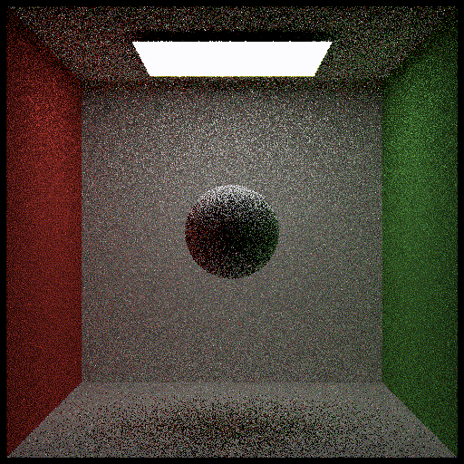
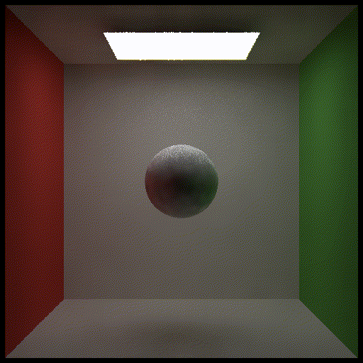

  <h1 align="center">Denoising</h1>
  <h2 align="center">Charles Zhang</h2>
  <h3 align="center">zzxdev@outlook.com</h3>

## About The Poject

This project implements a denoising algorithm used in real time ray tracing, utilizing the code base provided by [Professor Yan](https://sites.cs.ucsb.edu/~lingqi/)'s MOOC ([GAMES202: 高质量实时渲染](https://sites.cs.ucsb.edu/~lingqi/teaching/games202.html)).  

| Noised Image        | Denoised Image        |
| ------------------- | --------------------- |
|  |  |

## Implementation Details

This project implements single-frame denoising, forward reprojection, accumulation of information from multiple frames. 

G-buffers (such as color, depth, normal, etc) are provided by external files. 

## Reference

- Lecture 13: Real-Time Ray Tracing 2【GAMES202-高质量实时渲染】 https://www.bilibili.com/video/BV1YK4y1T7yY/?p=13&share_source=copy_web&vd_source=2de103c959465028f78ed53916bdfd35v (in Chinese)
-  Section 12.1.1 Bilateral Filtering, Real-Time Rendering 4th
-  `ffmpeg.exe -apply_trc iec61966_2_1 -i result_%d.exr filter.gif` to genearate a gif/video out of exr files

